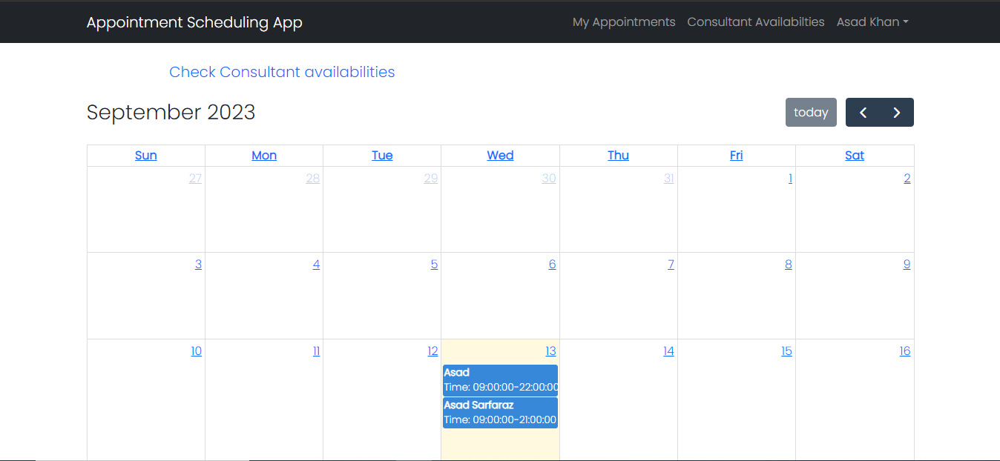
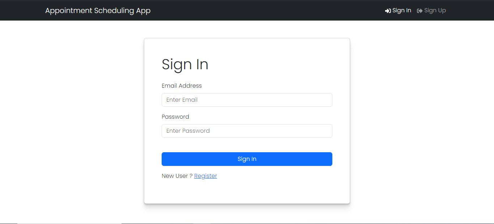
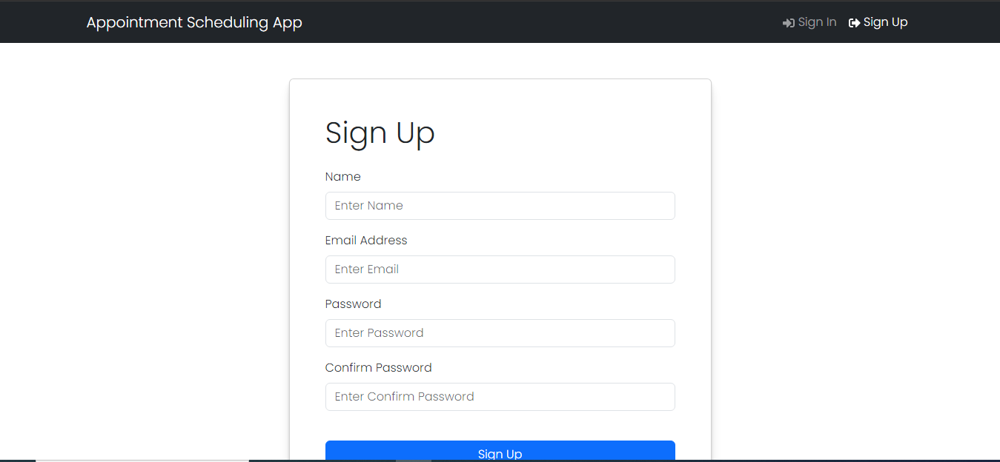

# Appointment Scheduling App





## Description


This is an appointment scheduling app that allows users to schedule appointments with consultants. It includes the following features:


1. **Login**: Users can log in to access their accounts.

    


2. **Register**: New users can register for an account.

    


3. **Update Profile**: Users can update their profile information.

    


4. **Home Page with Full Calendar**: The home page displays a full calendar for scheduling appointments with consultant availability.

    


5. **Consultant Availabilities**: Users can view the availability of consultants.

    


6. **Create Consultant Info**: Only consultant users can create and manage their profiles.

    


7. **Update Consultant Info**: Only consultant users can update their info.

    


8. **User Appointments**: Users can view their scheduled appointments.

    


9. **Create Appointment**: Users can create new appointments and will recieve confirmation mail after booking.

    

    


10. **Update Appointment**: Users can update existing appointments and will recieve mail of updated appointment.

    

    


11. **Delete Appointment**: Users can delete appointments they've scheduled by clicking delete button.

    


## Installation

Clone the repository:
```bash
$  git clone https://github.com/Asad474/Appointment-Scheduling-App.git
```


## Project Setup 
1. [Backend Setup](https://github.com/Asad474/Appointment-Scheduling-App/tree/main/backend)

2. [Frontend Setup](https://github.com/Asad474/Appointment-Scheduling-App/tree/main/frontend)